# Software Requirements Specification (SRS)

## Local Services Platform

**Version:** 2.7
**Date:** December 28, 2025
**Document Status:** Final

---

## Table of Contents

1. [Introduction](#1-introduction)
2. [Design Patterns](#2-design-patterns)
3. [High-Level System Architecture](#3-high-level-system-architecture)
4. [Microservices Architecture](#4-microservices-architecture)
5. [Event-Driven Architecture (EDA)](#5-event-driven-architecture-eda)
6. [Traefik Reverse Proxy & Load Balancing](#6-traefik-reverse-proxy--load-balancing)
7. [Backend Service Specifications](#7-backend-service-specifications)
8. [Frontend Application Architecture](#8-frontend-application-architecture)
9. [Database Schema](#9-database-schema)
10. [API Specification](#10-api-specification)
11. [Infrastructure Overview](#11-infrastructure-overview)
12. [Non-Functional Requirements](#12-non-functional-requirements)

---

## 1. Introduction

### 1.1 Purpose

This Software Requirements Specification (SRS) document provides a comprehensive technical overview of the **Local Services Platform** - a multi-tenant service booking system that connects customers with service technicians for home and local services.

### 1.2 Scope

The platform encompasses:

- **3 Frontend Applications**: Web (Customer), Admin, Technician portals
- **5 Backend Microservices**: Auth, Orders, Services, Payment, Notifications
- **Event-Driven Architecture**: RabbitMQ-based asynchronous communication
- **API Gateway**: Traefik for routing, load balancing, and CORS

### 1.3 Definitions & Acronyms

| Term           | Definition                   |
| -------------- | ---------------------------- |
| **EDA**        | Event-Driven Architecture    |
| **JWT**        | JSON Web Token               |
| **RBAC**       | Role-Based Access Control    |
| **IPN**        | Instant Payment Notification |
| **DLX**        | Dead Letter Exchange         |
| **SSLCommerz** | Bangladesh Payment Gateway   |
| **COD**        | Cash on Delivery             |

### 1.4 System Overview

Local Services is a comprehensive platform enabling:

- **Customers** to browse, book, and track home services
- **Administrators** to manage the platform, services, and assign technicians
- **Technicians** to view, accept, and complete assigned jobs

---

## 2. Design Patterns

This section documents the key software design patterns implemented across the platform to ensure maintainability, scalability, and clean architecture.

### 2.1 Design Patterns Overview

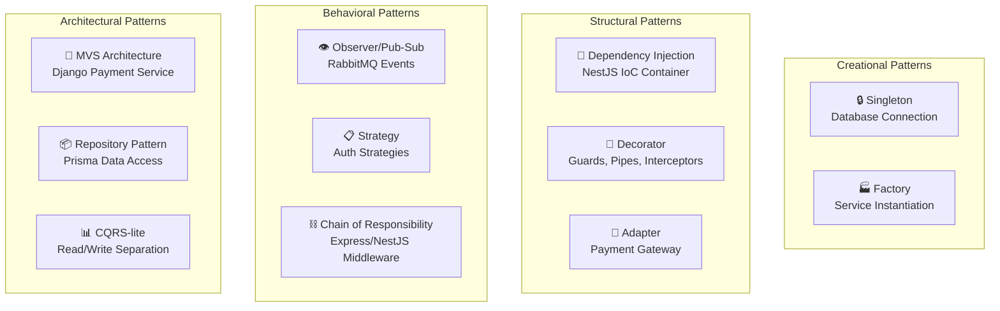
```mermaid
graph TB
    subgraph "Creational Patterns"
        Singleton[🔒 Singleton<br/>Database Connection]
        Factory[🏭 Factory<br/>Service Instantiation]
    end

    subgraph "Structural Patterns"
        DI[💉 Dependency Injection<br/>NestJS IoC Container]
        Decorator[🎀 Decorator<br/>Guards, Pipes, Interceptors]
        Adapter[🔌 Adapter<br/>Payment Gateway]
    end

    subgraph "Behavioral Patterns"
        Observer[👁️ Observer/Pub-Sub<br/>RabbitMQ Events]
        Strategy[📋 Strategy<br/>Auth Strategies]
        Middleware[⛓️ Chain of Responsibility<br/>Express/NestJS Middleware]
    end

    subgraph "Architectural Patterns"
        MVS[📐 MVS Architecture<br/>Django Payment Service]
        Repository[📦 Repository Pattern<br/>Prisma Data Access]
        CQRS[📊 CQRS-lite<br/>Read/Write Separation]
    end
```

### 2.2 Singleton Pattern - Database Connection

The Singleton pattern ensures a single database connection instance is shared across the application, optimizing resource usage and connection pooling.

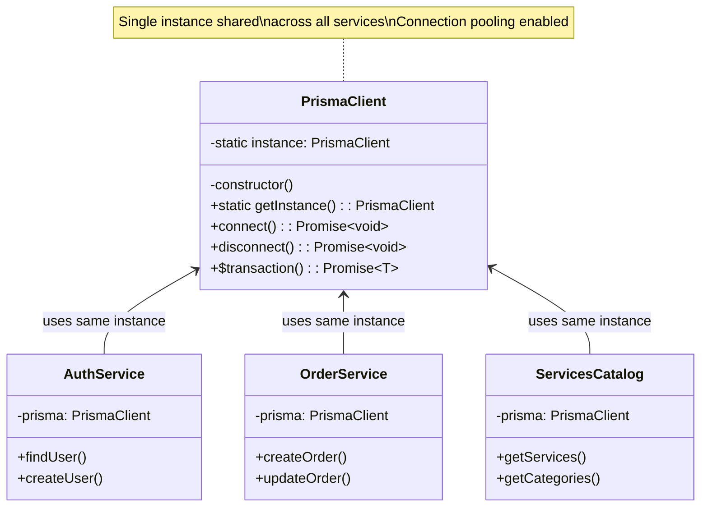
```mermaid
classDiagram
    class PrismaClient {
        -static instance: PrismaClient
        -constructor()
        +static getInstance(): PrismaClient
        +connect(): Promise~void~
        +disconnect(): Promise~void~
        +$transaction(): Promise~T~
    }

    class AuthService {
        -prisma: PrismaClient
        +findUser()
        +createUser()
    }

    class OrderService {
        -prisma: PrismaClient
        +createOrder()
        +updateOrder()
    }

    class ServicesCatalog {
        -prisma: PrismaClient
        +getServices()
        +getCategories()
    }

    PrismaClient <-- AuthService : uses same instance
    PrismaClient <-- OrderService : uses same instance
    PrismaClient <-- ServicesCatalog : uses same instance

    note for PrismaClient "Single instance shared\nacross all services\nConnection pooling enabled"
```

#### Implementation Details

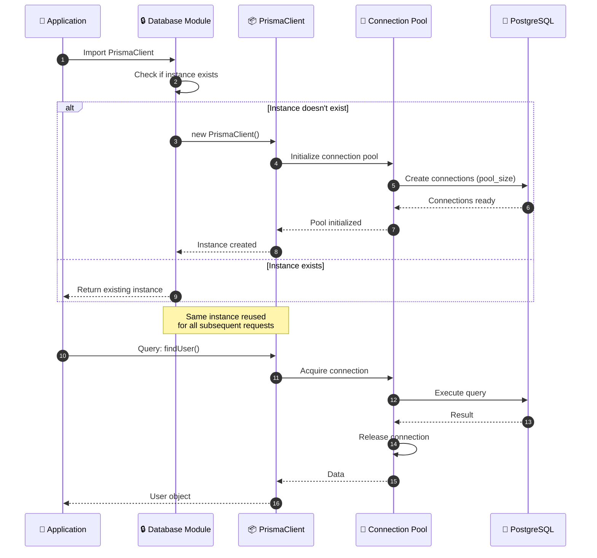
```mermaid
sequenceDiagram
    autonumber
    participant App as 🚀 Application
    participant DB as 🔒 Database Module
    participant Prisma as 📦 PrismaClient
    participant Pool as 🔗 Connection Pool
    participant PG as 🐘 PostgreSQL

    App->>DB: Import PrismaClient
    DB->>DB: Check if instance exists

    alt Instance doesn't exist
        DB->>Prisma: new PrismaClient()
        Prisma->>Pool: Initialize connection pool
        Pool->>PG: Create connections (pool_size)
        PG-->>Pool: Connections ready
        Pool-->>Prisma: Pool initialized
        Prisma-->>DB: Instance created
    else Instance exists
        DB-->>App: Return existing instance
    end

    Note over DB,Prisma: Same instance reused<br/>for all subsequent requests

    App->>Prisma: Query: findUser()
    Prisma->>Pool: Acquire connection
    Pool->>PG: Execute query
    PG-->>Pool: Result
    Pool->>Pool: Release connection
    Pool-->>Prisma: Data
    Prisma-->>App: User object
```

#### Singleton in Each Service

| Service      | Singleton Implementation   | File Path                                        |
| ------------ | -------------------------- | ------------------------------------------------ |
| **Auth**     | `PrismaModule` (global)    | `/services/auth/src/prisma/prisma.module.ts`     |
| **Orders**   | `prisma` singleton export  | `/services/orders/src/config/database.ts`        |
| **Services** | `PrismaModule` (global)    | `/services/services/src/prisma/prisma.module.ts` |
| **RabbitMQ** | `RabbitMQClient` singleton | `/packages/rabbitmq-client/src/client.ts`        |

### 2.3 Dependency Injection Pattern - NestJS

NestJS leverages Dependency Injection (DI) through its Inversion of Control (IoC) container, enabling loose coupling and testability.

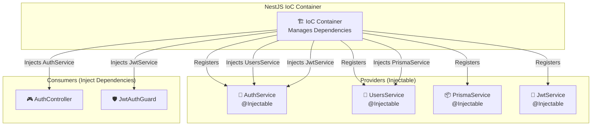
```mermaid
graph TB
    subgraph "NestJS IoC Container"
        Container[🏗️ IoC Container<br/>Manages Dependencies]
    end

    subgraph "Providers (Injectable)"
        AuthService[🔐 AuthService<br/>@Injectable]
        UsersService[👥 UsersService<br/>@Injectable]
        PrismaService[📦 PrismaService<br/>@Injectable]
        JwtService[🔑 JwtService<br/>@Injectable]
    end

    subgraph "Consumers (Inject Dependencies)"
        AuthController[🎮 AuthController]
        AuthGuard[🛡️ JwtAuthGuard]
    end

    Container -->|Registers| AuthService
    Container -->|Registers| UsersService
    Container -->|Registers| PrismaService
    Container -->|Registers| JwtService

    Container -->|Injects AuthService| AuthController
    Container -->|Injects UsersService| AuthService
    Container -->|Injects PrismaService| UsersService
    Container -->|Injects JwtService| AuthService
    Container -->|Injects JwtService| AuthGuard
```

#### DI Container Flow

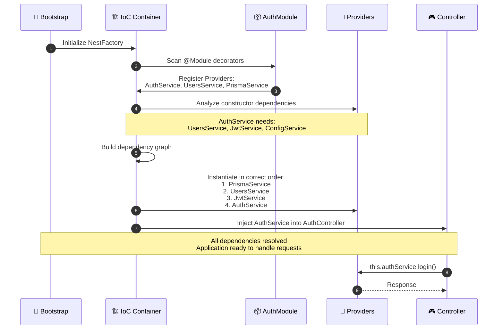
```mermaid
sequenceDiagram
    autonumber
    participant Boot as 🚀 Bootstrap
    participant Container as 🏗️ IoC Container
    participant Module as 📦 AuthModule
    participant Provider as 💉 Providers
    participant Controller as 🎮 Controller

    Boot->>Container: Initialize NestFactory
    Container->>Module: Scan @Module decorators

    Module->>Container: Register Providers:<br/>AuthService, UsersService, PrismaService

    Container->>Provider: Analyze constructor dependencies
    Note over Container,Provider: AuthService needs:<br/>UsersService, JwtService, ConfigService

    Container->>Container: Build dependency graph
    Container->>Provider: Instantiate in correct order:<br/>1. PrismaService<br/>2. UsersService<br/>3. JwtService<br/>4. AuthService

    Container->>Controller: Inject AuthService into AuthController

    Note over Boot,Controller: All dependencies resolved<br/>Application ready to handle requests

    Controller->>Provider: this.authService.login()
    Provider-->>Controller: Response
```

#### DI Scopes in NestJS

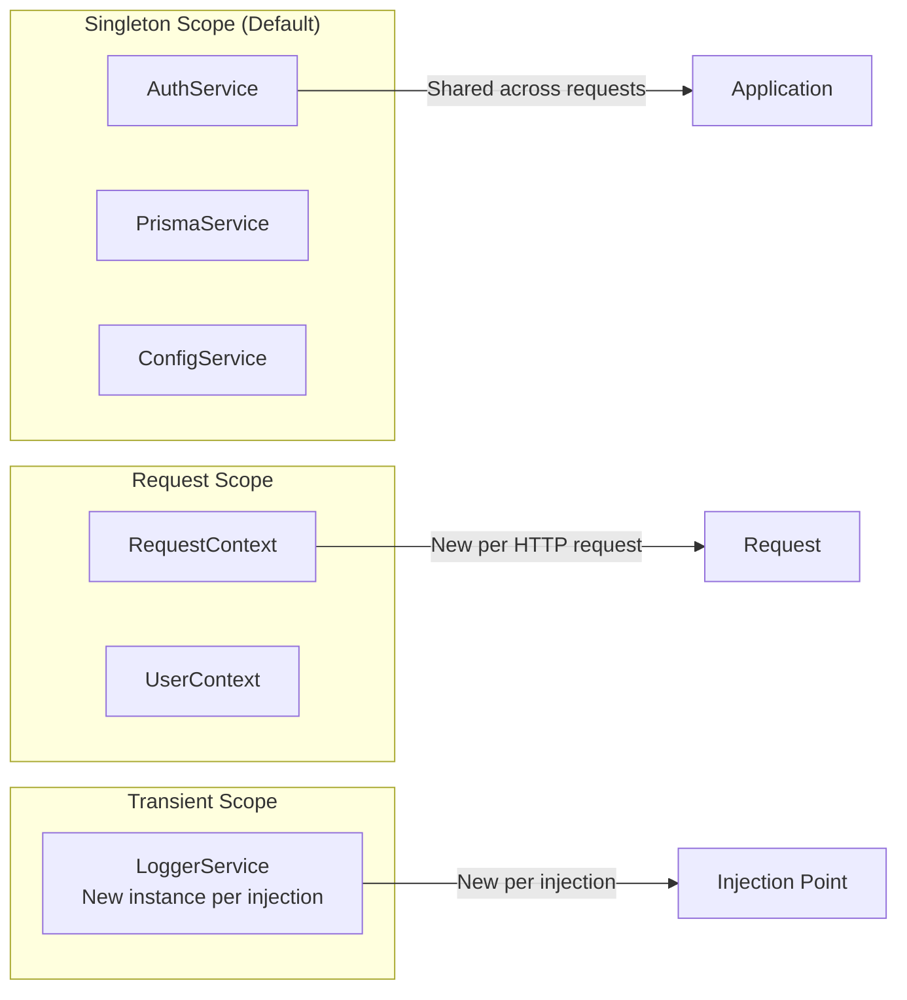
```mermaid
graph LR
    subgraph "Singleton Scope (Default)"
        S1[AuthService]
        S2[PrismaService]
        S3[ConfigService]
    end

    subgraph "Request Scope"
        R1[RequestContext]
        R2[UserContext]
    end

    subgraph "Transient Scope"
        T1[LoggerService<br/>New instance per injection]
    end

    S1 -->|Shared across requests| App[Application]
    R1 -->|New per HTTP request| Req[Request]
    T1 -->|New per injection| Inj[Injection Point]
```

#### Module Dependency Graph

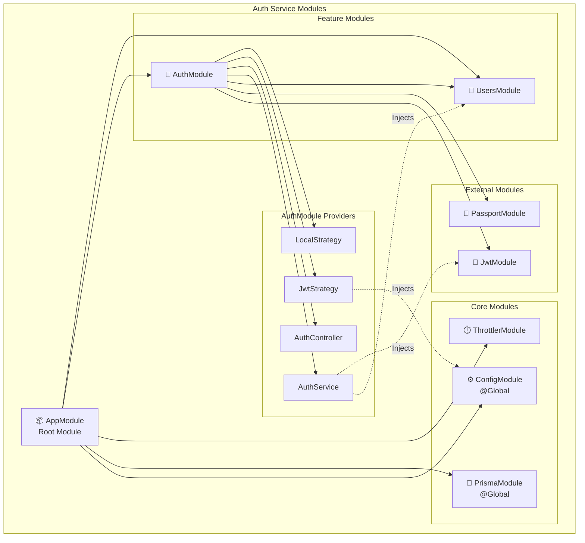
```mermaid
graph TB
    subgraph "Auth Service Modules"
        AppModule[📦 AppModule<br/>Root Module]

        subgraph "Core Modules"
            ConfigModule[⚙️ ConfigModule<br/>@Global]
            PrismaModule[🔌 PrismaModule<br/>@Global]
            ThrottlerModule[⏱️ ThrottlerModule]
        end

        subgraph "Feature Modules"
            AuthModule[🔐 AuthModule]
            UsersModule[👥 UsersModule]
        end

        subgraph "AuthModule Providers"
            AuthService[AuthService]
            AuthController[AuthController]
            JwtStrategy[JwtStrategy]
            LocalStrategy[LocalStrategy]
        end

        subgraph "External Modules"
            JwtModule[🔑 JwtModule]
            PassportModule[🛂 PassportModule]
        end
    end

    AppModule --> ConfigModule
    AppModule --> PrismaModule
    AppModule --> ThrottlerModule
    AppModule --> AuthModule
    AppModule --> UsersModule

    AuthModule --> JwtModule
    AuthModule --> PassportModule
    AuthModule --> UsersModule

    AuthModule --> AuthService
    AuthModule --> AuthController
    AuthModule --> JwtStrategy
    AuthModule --> LocalStrategy

    AuthService -.->|Injects| UsersModule
    AuthService -.->|Injects| JwtModule
    JwtStrategy -.->|Injects| ConfigModule
```

### 2.4 Django MVS Architecture - Payment Service

The Payment Service uses Django's Model-View-Serializer (MVS) architecture, an adaptation of MVC optimized for REST APIs.

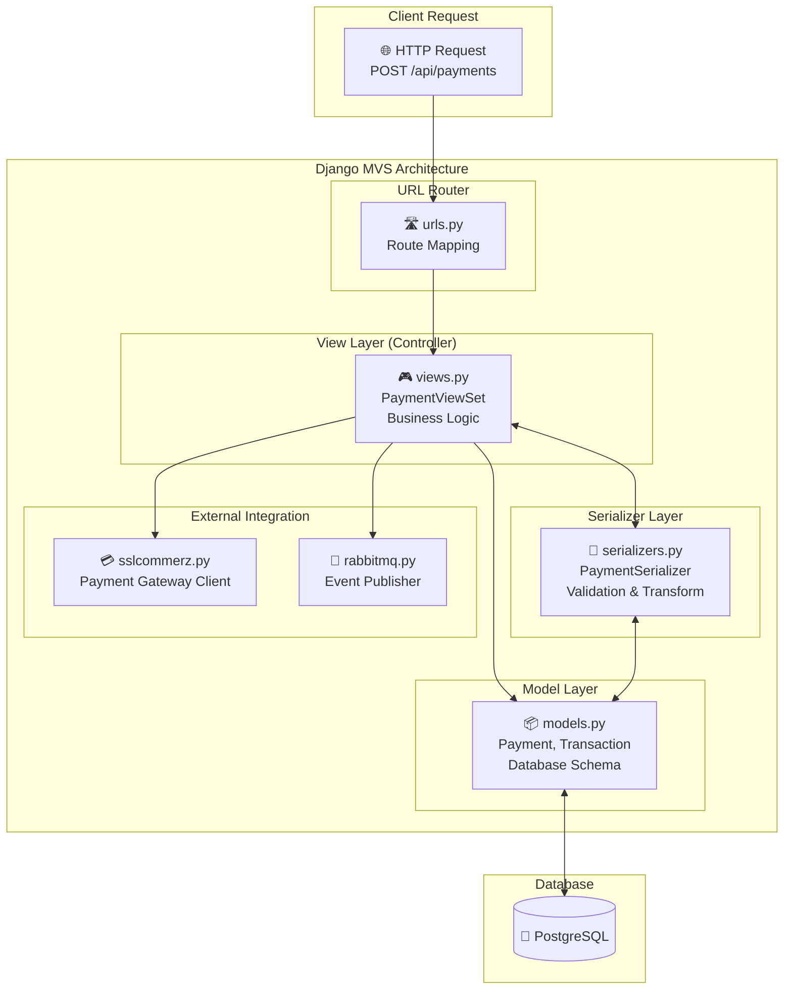
```mermaid
graph TB
    subgraph "Client Request"
        Client[🌐 HTTP Request<br/>POST /api/payments]
    end

    subgraph "Django MVS Architecture"
        subgraph "URL Router"
            URLs[🛣️ urls.py<br/>Route Mapping]
        end

        subgraph "View Layer (Controller)"
            Views[🎮 views.py<br/>PaymentViewSet<br/>Business Logic]
        end

        subgraph "Serializer Layer"
            Serializers[📝 serializers.py<br/>PaymentSerializer<br/>Validation & Transform]
        end

        subgraph "Model Layer"
            Models[📦 models.py<br/>Payment, Transaction<br/>Database Schema]
        end

        subgraph "External Integration"
            SSLCommerz[💳 sslcommerz.py<br/>Payment Gateway Client]
            RabbitMQ[🐰 rabbitmq.py<br/>Event Publisher]
        end
    end

    subgraph "Database"
        DB[(🐘 PostgreSQL)]
    end

    Client --> URLs
    URLs --> Views
    Views <--> Serializers
    Views --> Models
    Views --> SSLCommerz
    Views --> RabbitMQ
    Models <--> DB
    Serializers <--> Models
```

#### MVS Request-Response Flow

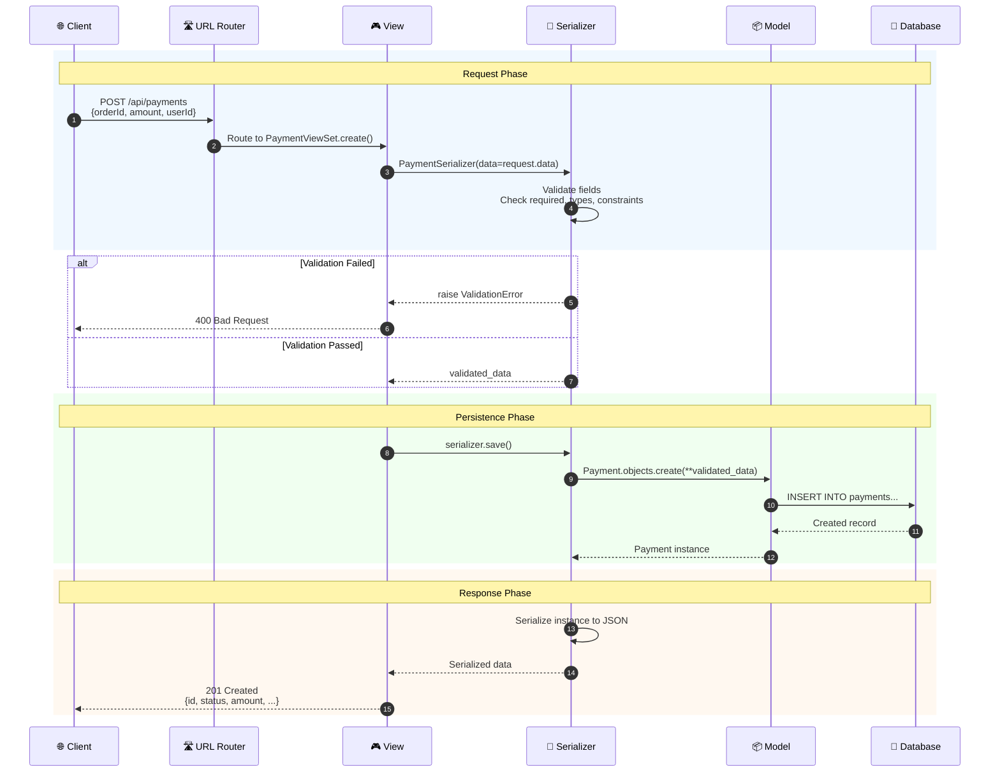
```mermaid
sequenceDiagram
    autonumber
    participant C as 🌐 Client
    participant U as 🛣️ URL Router
    participant V as 🎮 View
    participant S as 📝 Serializer
    participant M as 📦 Model
    participant DB as 🐘 Database

    rect rgb(240, 248, 255)
        Note over C,DB: Request Phase
        C->>U: POST /api/payments<br/>{orderId, amount, userId}
        U->>V: Route to PaymentViewSet.create()
        V->>S: PaymentSerializer(data=request.data)
        S->>S: Validate fields<br/>Check required, types, constraints
    end

    alt Validation Failed
        S-->>V: raise ValidationError
        V-->>C: 400 Bad Request
    else Validation Passed
        S-->>V: validated_data
    end

    rect rgb(240, 255, 240)
        Note over C,DB: Persistence Phase
        V->>S: serializer.save()
        S->>M: Payment.objects.create(**validated_data)
        M->>DB: INSERT INTO payments...
        DB-->>M: Created record
        M-->>S: Payment instance
    end

    rect rgb(255, 248, 240)
        Note over C,DB: Response Phase
        S->>S: Serialize instance to JSON
        S-->>V: Serialized data
        V-->>C: 201 Created<br/>{id, status, amount, ...}
    end
```

#### MVS Component Responsibilities

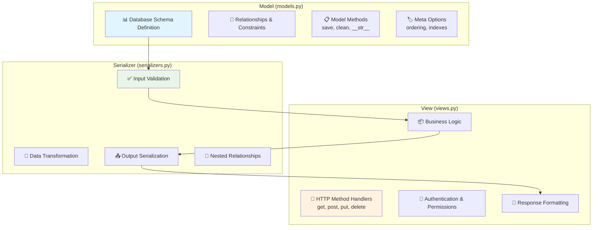
```mermaid
graph TB
    subgraph "Model (models.py)"
        M1[📊 Database Schema Definition]
        M2[🔗 Relationships & Constraints]
        M3[📋 Model Methods<br/>save, clean, __str__]
        M4[🏷️ Meta Options<br/>ordering, indexes]
    end

    subgraph "View (views.py)"
        V1[🎯 HTTP Method Handlers<br/>get, post, put, delete]
        V2[🔐 Authentication & Permissions]
        V3[📦 Business Logic]
        V4[🔄 Response Formatting]
    end

    subgraph "Serializer (serializers.py)"
        S1[✅ Input Validation]
        S2[🔄 Data Transformation]
        S3[📤 Output Serialization]
        S4[🔗 Nested Relationships]
    end

    M1 --> S1
    S1 --> V3
    V3 --> S3
    S3 --> V4

    style M1 fill:#e1f5fe
    style V1 fill:#fff3e0
    style S1 fill:#e8f5e9
```

### 2.5 Repository Pattern - Data Access Layer

The Repository pattern abstracts data access logic, providing a clean separation between business logic and database operations.

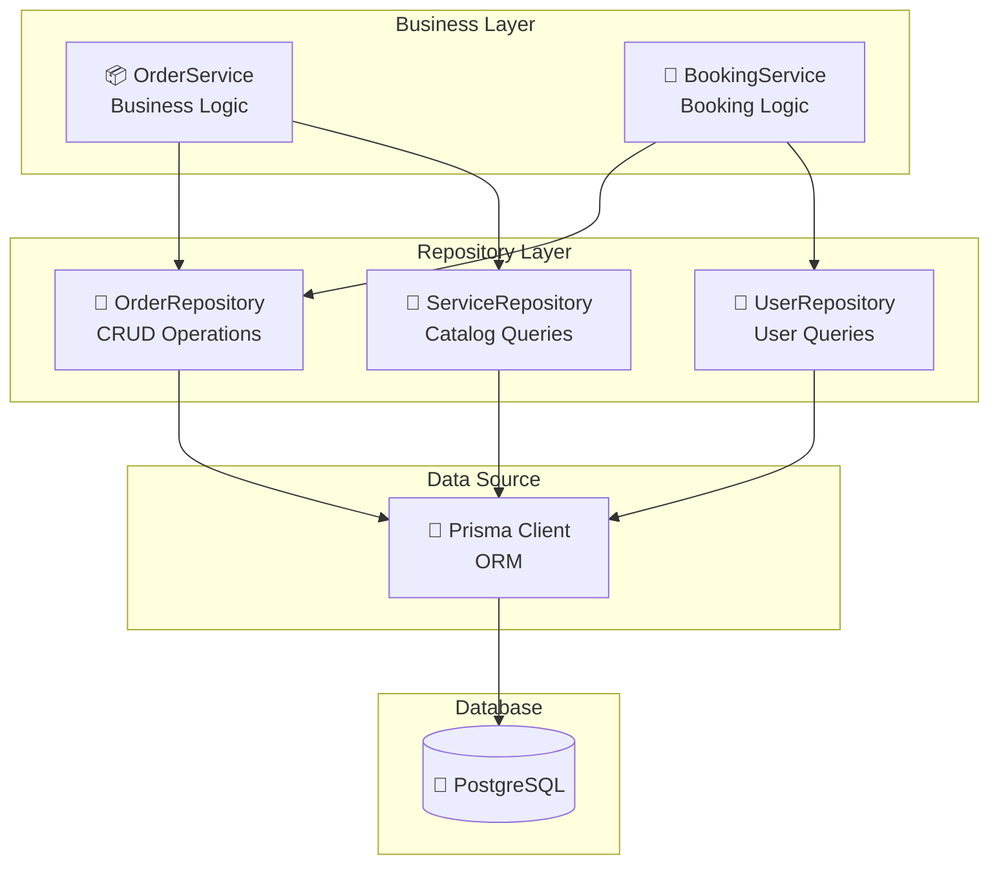
```mermaid
graph TB
    subgraph "Business Layer"
        OrderService[📦 OrderService<br/>Business Logic]
        BookingService[📅 BookingService<br/>Booking Logic]
    end

    subgraph "Repository Layer"
        OrderRepo[📂 OrderRepository<br/>CRUD Operations]
        UserRepo[📂 UserRepository<br/>User Queries]
        ServiceRepo[📂 ServiceRepository<br/>Catalog Queries]
    end

    subgraph "Data Source"
        Prisma[🔌 Prisma Client<br/>ORM]
    end

    subgraph "Database"
        PG[(🐘 PostgreSQL)]
    end

    OrderService --> OrderRepo
    OrderService --> ServiceRepo
    BookingService --> OrderRepo
    BookingService --> UserRepo

    OrderRepo --> Prisma
    UserRepo --> Prisma
    ServiceRepo --> Prisma

    Prisma --> PG
```

#### Repository Implementation

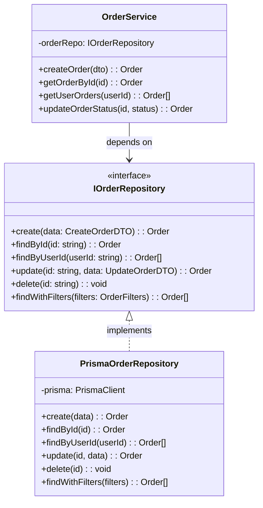
```mermaid
classDiagram
    class IOrderRepository {
        <<interface>>
        +create(data: CreateOrderDTO): Order
        +findById(id: string): Order
        +findByUserId(userId: string): Order[]
        +update(id: string, data: UpdateOrderDTO): Order
        +delete(id: string): void
        +findWithFilters(filters: OrderFilters): Order[]
    }

    class PrismaOrderRepository {
        -prisma: PrismaClient
        +create(data): Order
        +findById(id): Order
        +findByUserId(userId): Order[]
        +update(id, data): Order
        +delete(id): void
        +findWithFilters(filters): Order[]
    }

    class OrderService {
        -orderRepo: IOrderRepository
        +createOrder(dto): Order
        +getOrderById(id): Order
        +getUserOrders(userId): Order[]
        +updateOrderStatus(id, status): Order
    }

    IOrderRepository <|.. PrismaOrderRepository : implements
    OrderService --> IOrderRepository : depends on
```

### 2.6 Observer Pattern - Event-Driven Communication

The Observer/Pub-Sub pattern enables loose coupling between services through RabbitMQ message broker.

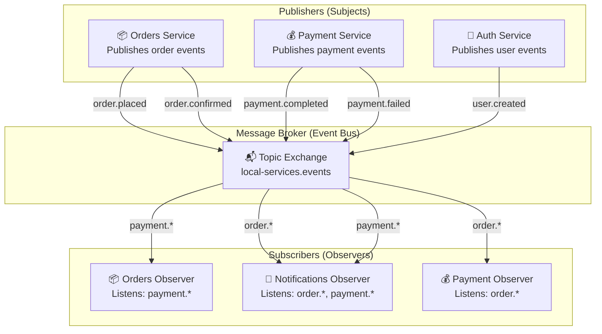
```mermaid
graph TB
    subgraph "Publishers (Subjects)"
        OrdersSvc[📦 Orders Service<br/>Publishes order events]
        PaymentSvc[💰 Payment Service<br/>Publishes payment events]
        AuthSvc[🔐 Auth Service<br/>Publishes user events]
    end

    subgraph "Message Broker (Event Bus)"
        Exchange[📬 Topic Exchange<br/>local-services.events]
    end

    subgraph "Subscribers (Observers)"
        OrdersObs[📦 Orders Observer<br/>Listens: payment.*]
        NotifObs[📧 Notifications Observer<br/>Listens: order.*, payment.*]
        PaymentObs[💰 Payment Observer<br/>Listens: order.*]
    end

    OrdersSvc -->|order.placed| Exchange
    OrdersSvc -->|order.confirmed| Exchange
    PaymentSvc -->|payment.completed| Exchange
    PaymentSvc -->|payment.failed| Exchange
    AuthSvc -->|user.created| Exchange

    Exchange -->|payment.*| OrdersObs
    Exchange -->|order.*| NotifObs
    Exchange -->|payment.*| NotifObs
    Exchange -->|order.*| PaymentObs
```

#### Observer Pattern Flow

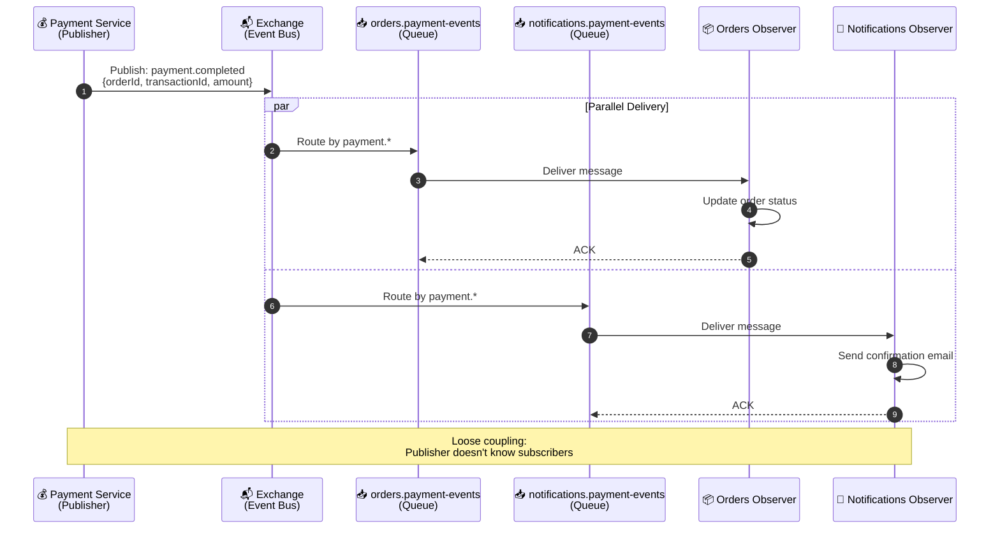
```mermaid
sequenceDiagram
    autonumber
    participant P as 💰 Payment Service<br/>(Publisher)
    participant E as 📬 Exchange<br/>(Event Bus)
    participant Q1 as 📥 orders.payment-events<br/>(Queue)
    participant Q2 as 📥 notifications.payment-events<br/>(Queue)
    participant O as 📦 Orders Observer
    participant N as 📧 Notifications Observer

    P->>E: Publish: payment.completed<br/>{orderId, transactionId, amount}

    par Parallel Delivery
        E->>Q1: Route by payment.*
        Q1->>O: Deliver message
        O->>O: Update order status
        O-->>Q1: ACK
    and
        E->>Q2: Route by payment.*
        Q2->>N: Deliver message
        N->>N: Send confirmation email
        N-->>Q2: ACK
    end

    Note over P,N: Loose coupling:<br/>Publisher doesn't know subscribers
```

### 2.7 Strategy Pattern - Authentication Strategies

The Strategy pattern allows switching between different authentication mechanisms at runtime.

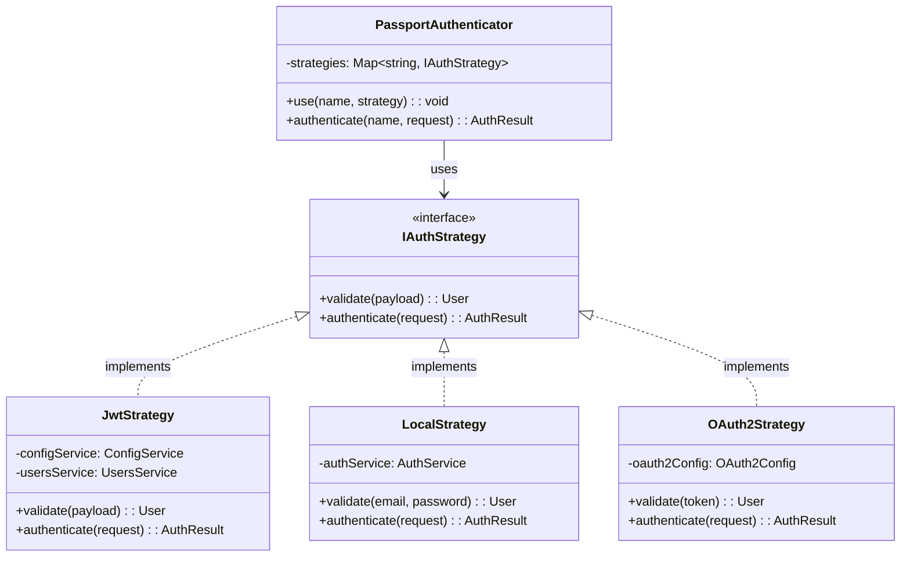
```mermaid
classDiagram
    class IAuthStrategy {
        <<interface>>
        +validate(payload): User
        +authenticate(request): AuthResult
    }

    class JwtStrategy {
        -configService: ConfigService
        -usersService: UsersService
        +validate(payload): User
        +authenticate(request): AuthResult
    }

    class LocalStrategy {
        -authService: AuthService
        +validate(email, password): User
        +authenticate(request): AuthResult
    }

    class OAuth2Strategy {
        -oauth2Config: OAuth2Config
        +validate(token): User
        +authenticate(request): AuthResult
    }

    class PassportAuthenticator {
        -strategies: Map~string, IAuthStrategy~
        +use(name, strategy): void
        +authenticate(name, request): AuthResult
    }

    IAuthStrategy <|.. JwtStrategy : implements
    IAuthStrategy <|.. LocalStrategy : implements
    IAuthStrategy <|.. OAuth2Strategy : implements
    PassportAuthenticator --> IAuthStrategy : uses
```

#### Strategy Selection Flow

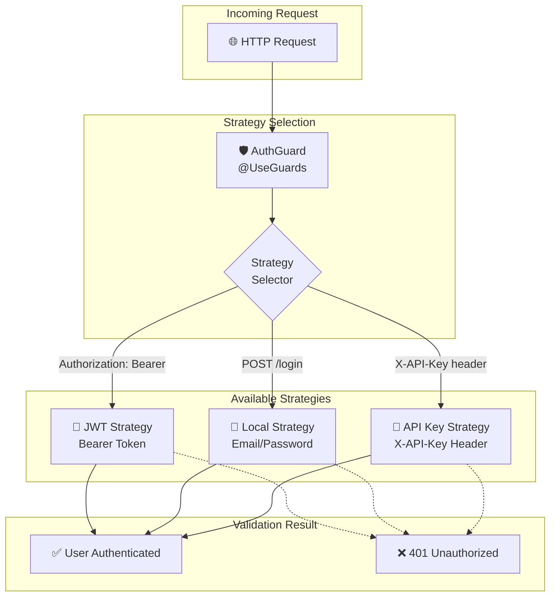
```mermaid
graph TB
    subgraph "Incoming Request"
        Req[🌐 HTTP Request]
    end

    subgraph "Strategy Selection"
        Guard[🛡️ AuthGuard<br/>@UseGuards]
        Selector{Strategy<br/>Selector}
    end

    subgraph "Available Strategies"
        JWT[🔑 JWT Strategy<br/>Bearer Token]
        Local[👤 Local Strategy<br/>Email/Password]
        API[🔐 API Key Strategy<br/>X-API-Key Header]
    end

    subgraph "Validation Result"
        Success[✅ User Authenticated]
        Failure[❌ 401 Unauthorized]
    end

    Req --> Guard
    Guard --> Selector

    Selector -->|Authorization: Bearer| JWT
    Selector -->|POST /login| Local
    Selector -->|X-API-Key header| API

    JWT --> Success
    Local --> Success
    API --> Success
    JWT -.-> Failure
    Local -.-> Failure
    API -.-> Failure
```

### 2.8 Decorator Pattern - NestJS Enhancements

NestJS heavily uses the Decorator pattern for adding metadata and behavior to classes, methods, and parameters.

```mermaid
graph TB
    subgraph "Class Decorators"
        Controller[@Controller<br/>Route prefix]
        Injectable[@Injectable<br/>DI provider]
        Module[@Module<br/>Feature module]
    end

    subgraph "Method Decorators"
        Get[@Get, @Post, @Patch<br/>HTTP methods]
        UseGuards[@UseGuards<br/>Auth protection]
        UseInterceptors[@UseInterceptors<br/>Transform response]
        UsePipes[@UsePipes<br/>Validation]
    end

    subgraph "Parameter Decorators"
        Body[@Body<br/>Request body]
        Param[@Param<br/>Route params]
        Query[@Query<br/>Query string]
        Req[@Request<br/>Full request]
    end

    subgraph "Custom Decorators"
        CurrentUser[@CurrentUser<br/>Extract user from JWT]
        Roles[@Roles<br/>Required roles]
        Public[@Public<br/>Skip auth]
    end
```

#### Decorator Chain Execution

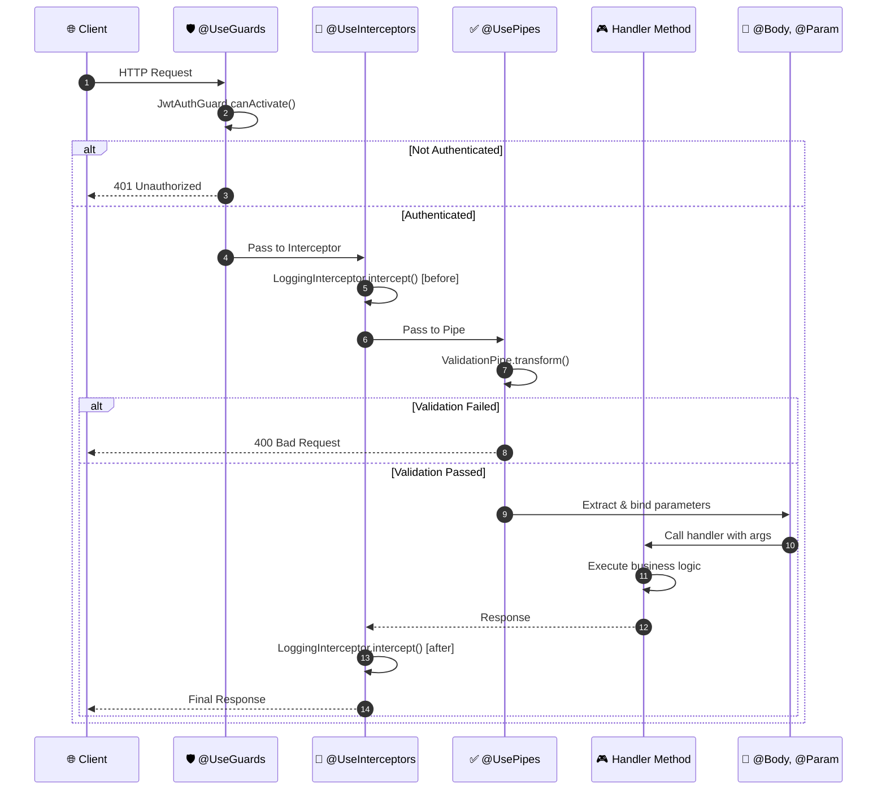
```mermaid
sequenceDiagram
    autonumber
    participant C as 🌐 Client
    participant G as 🛡️ @UseGuards
    participant I as 🔄 @UseInterceptors
    participant P as ✅ @UsePipes
    participant H as 🎮 Handler Method
    participant D as 📝 @Body, @Param

    C->>G: HTTP Request
    G->>G: JwtAuthGuard.canActivate()

    alt Not Authenticated
        G-->>C: 401 Unauthorized
    else Authenticated
        G->>I: Pass to Interceptor
        I->>I: LoggingInterceptor.intercept() [before]
        I->>P: Pass to Pipe
        P->>P: ValidationPipe.transform()

        alt Validation Failed
            P-->>C: 400 Bad Request
        else Validation Passed
            P->>D: Extract & bind parameters
            D->>H: Call handler with args
            H->>H: Execute business logic
            H-->>I: Response
            I->>I: LoggingInterceptor.intercept() [after]
            I-->>C: Final Response
        end
    end
```

### 2.9 Middleware/Chain of Responsibility Pattern

Request processing flows through a chain of middleware, each handling a specific concern.

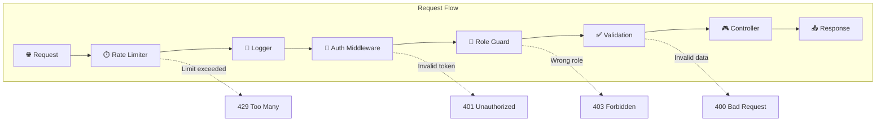
```mermaid
graph LR
    subgraph "Request Flow"
        Req[🌐 Request] --> M1
        M1[⏱️ Rate Limiter] --> M2
        M2[📝 Logger] --> M3
        M3[🔐 Auth Middleware] --> M4
        M4[👤 Role Guard] --> M5
        M5[✅ Validation] --> Handler
        Handler[🎮 Controller] --> Res[📤 Response]
    end

    M1 -.->|Limit exceeded| Reject1[429 Too Many]
    M3 -.->|Invalid token| Reject2[401 Unauthorized]
    M4 -.->|Wrong role| Reject3[403 Forbidden]
    M5 -.->|Invalid data| Reject4[400 Bad Request]
```

### 2.10 Adapter Pattern - Payment Gateway Integration

The Adapter pattern provides a unified interface for different payment gateway implementations.

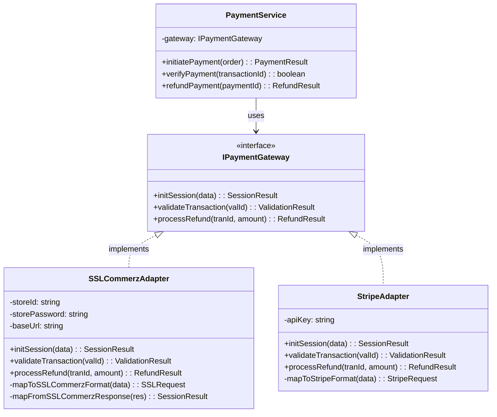
```mermaid
classDiagram
    class IPaymentGateway {
        <<interface>>
        +initSession(data): SessionResult
        +validateTransaction(valId): ValidationResult
        +processRefund(tranId, amount): RefundResult
    }

    class SSLCommerzAdapter {
        -storeId: string
        -storePassword: string
        -baseUrl: string
        +initSession(data): SessionResult
        +validateTransaction(valId): ValidationResult
        +processRefund(tranId, amount): RefundResult
        -mapToSSLCommerzFormat(data): SSLRequest
        -mapFromSSLCommerzResponse(res): SessionResult
    }

    class StripeAdapter {
        -apiKey: string
        +initSession(data): SessionResult
        +validateTransaction(valId): ValidationResult
        +processRefund(tranId, amount): RefundResult
        -mapToStripeFormat(data): StripeRequest
    }

    class PaymentService {
        -gateway: IPaymentGateway
        +initiatePayment(order): PaymentResult
        +verifyPayment(transactionId): boolean
        +refundPayment(paymentId): RefundResult
    }

    IPaymentGateway <|.. SSLCommerzAdapter : implements
    IPaymentGateway <|.. StripeAdapter : implements
    PaymentService --> IPaymentGateway : uses
```

### 2.11 Design Patterns Summary Matrix

| Pattern                         | Type          | Used In            | Purpose                     |
| ------------------------------- | ------------- | ------------------ | --------------------------- |
| **Singleton**                   | Creational    | Database, RabbitMQ | Single shared instance      |
| **Dependency Injection**        | Structural    | NestJS Services    | Loose coupling, testability |
| **MVS (Model-View-Serializer)** | Architectural | Django Payment     | REST API structure          |
| **Repository**                  | Structural    | Data Access        | Abstract persistence        |
| **Observer/Pub-Sub**            | Behavioral    | RabbitMQ Events    | Decoupled communication     |
| **Strategy**                    | Behavioral    | Passport.js Auth   | Switchable algorithms       |
| **Decorator**                   | Structural    | NestJS             | Metadata & behavior         |
| **Chain of Responsibility**     | Behavioral    | Middleware         | Sequential processing       |
| **Adapter**                     | Structural    | Payment Gateway    | Interface compatibility     |
| **Factory**                     | Creational    | Module Providers   | Object creation             |

---

## 3. High-Level System Architecture

### 3.1 C4 System Context Diagram

```mermaid
graph TB
    subgraph "External Actors"
        Customer[👤 Customer<br/>Books and tracks services]
        Technician[🔧 Technician<br/>Completes service jobs]
        Admin[👔 Administrator<br/>Manages platform]
        SSLCommerz[💳 SSLCommerz<br/>Payment Gateway]
    end

    subgraph "Local Services Platform"
        direction TB
        subgraph "Frontend Layer"
            WebApp[🌐 Web App<br/>Next.js :3000]
            AdminApp[📊 Admin Panel<br/>Next.js :3010]
            TechApp[📱 Technician App<br/>Next.js :3020]
        end

        subgraph "API Gateway"
            Traefik[🔀 Traefik<br/>Reverse Proxy :80]
        end

        subgraph "Backend Services"
            AuthSvc[🔐 Auth Service]
            OrdersSvc[📦 Orders Service]
            ServicesSvc[🛠️ Services API]
            PaymentSvc[💰 Payment Service]
            NotifSvc[📧 Notifications]
        end

        subgraph "Data Layer"
            PostgreSQL[(🐘 PostgreSQL)]
            RabbitMQ[🐰 RabbitMQ]
        end
    end

    Customer --> WebApp
    Technician --> TechApp
    Admin --> AdminApp

    WebApp & AdminApp & TechApp --> Traefik
    Traefik --> AuthSvc & OrdersSvc & ServicesSvc & PaymentSvc

    AuthSvc & OrdersSvc & ServicesSvc --> PostgreSQL
    PaymentSvc --> PostgreSQL
    OrdersSvc & PaymentSvc & NotifSvc <--> RabbitMQ

    PaymentSvc <--> SSLCommerz
```

### 3.2 Container Deployment Diagram

```mermaid
graph TB
    subgraph "Docker Host"
        subgraph "Infrastructure"
            traefik[traefik:v3.0<br/>:80, :8080]
            postgres[(postgres:16-alpine<br/>:5432)]
            rabbitmq[rabbitmq:3-management<br/>:5672, :15672]
        end

        subgraph "Backend Containers"
            auth[auth-service<br/>NestJS :3001]
            orders[orders-service<br/>Express :3003]
            services[services-api<br/>NestJS :3002]
            payment[payment-service<br/>Django :8000]
            notifications[notifications<br/>FastAPI :3002]
        end

        subgraph "Frontend Containers"
            web[web-app<br/>Next.js :3000]
            admin[admin-panel<br/>Next.js :3010]
            technician[technician-app<br/>Next.js :3020]
        end

        subgraph "Volumes"
            pgdata[(postgres_data)]
            rmqdata[(rabbitmq_data)]
        end
    end

    traefik --> auth & orders & services & payment
    traefik --> web & admin & technician
    auth & orders & services --> postgres
    payment --> postgres
    orders & payment & notifications --> rabbitmq
    postgres --- pgdata
    rabbitmq --- rmqdata
```

---

## 4. Microservices Architecture

### 4.1 Service Topology

```mermaid
graph LR
    subgraph "API Gateway Layer"
        Traefik[🔀 Traefik<br/>Port 80]
    end

    subgraph "Backend Microservices"
        Auth[🔐 Auth Service<br/>NestJS :3001<br/>JWT, RBAC]
        Orders[📦 Orders Service<br/>Express :3003<br/>Booking, Assignment]
        Services[🛠️ Services API<br/>NestJS :3002<br/>Catalog, Pricing]
        Payment[💰 Payment Service<br/>Django :8000<br/>SSLCommerz]
        Notifications[📧 Notifications<br/>FastAPI<br/>Email, SMS]
    end

    subgraph "Message Broker"
        RabbitMQ[🐰 RabbitMQ<br/>:5672<br/>Topic Exchange]
    end

    subgraph "Database Layer"
        PostgreSQL[(🐘 PostgreSQL<br/>:5432<br/>Prisma ORM)]
    end

    Traefik -->|/api/auth| Auth
    Traefik -->|/api/orders| Orders
    Traefik -->|/api/services| Services
    Traefik -->|/api/payments| Payment

    Auth --> PostgreSQL
    Orders --> PostgreSQL
    Services --> PostgreSQL
    Payment --> PostgreSQL

    Orders <-->|Events| RabbitMQ
    Payment <-->|Events| RabbitMQ
    Notifications <--|Consumes| RabbitMQ
```

### 4.2 Service Summary Table

| Service           | Technology          | Port | Database   | Message Broker     | Primary Function                                |
| ----------------- | ------------------- | ---- | ---------- | ------------------ | ----------------------------------------------- |
| **Auth**          | NestJS + Passport   | 3001 | PostgreSQL | -                  | Authentication, JWT, User management            |
| **Orders**        | Express.js + Prisma | 3003 | PostgreSQL | RabbitMQ (Pub/Sub) | Order lifecycle, Booking, Technician assignment |
| **Services**      | NestJS + Prisma     | 3002 | PostgreSQL | RabbitMQ (Pub)     | Service catalog, Categories, Pricing            |
| **Payment**       | Django + DRF        | 8000 | PostgreSQL | RabbitMQ (Pub)     | Payment processing, SSLCommerz integration      |
| **Notifications** | FastAPI             | 3002 | -          | RabbitMQ (Sub)     | Email, SMS notifications                        |

---

## 5. Event-Driven Architecture (EDA)

### 5.1 RabbitMQ Exchange & Queue Topology

```mermaid
graph TB
    subgraph "Publishers"
        OrdersSvc[📦 Orders Service]
        PaymentSvc[💰 Payment Service]
        ServicesSvc[🛠️ Services Service]
        AuthSvc[🔐 Auth Service]
    end

    subgraph "Exchanges"
        EventsExchange[local-services.events<br/>📬 Topic Exchange<br/>Durable: true]
        DLX[local-services.dead-letter<br/>☠️ Dead Letter Exchange<br/>Durable: true]
    end

    subgraph "Queues"
        Q1[orders.payment-events<br/>📥 Binding: payment.*]
        Q2[payment.order-events<br/>📥 Binding: order.*]
        Q3[notifications.order-events<br/>📥 Binding: order.*]
        Q4[notifications.payment-events<br/>📥 Binding: payment.*]
        Q5[notifications.user-events<br/>📥 Binding: user.*]
    end

    subgraph "Consumers"
        OrdersConsumer[📦 Orders Service<br/>Consumer]
        PaymentConsumer[💰 Payment Service<br/>Consumer]
        NotifConsumer[📧 Notifications<br/>Consumer]
    end

    OrdersSvc -->|order.placed<br/>order.confirmed<br/>order.assigned| EventsExchange
    PaymentSvc -->|payment.completed<br/>payment.failed| EventsExchange
    ServicesSvc -->|service.created<br/>service.updated| EventsExchange
    AuthSvc -->|user.created<br/>user.updated| EventsExchange

    EventsExchange -->|payment.*| Q1
    EventsExchange -->|order.*| Q2
    EventsExchange -->|order.*| Q3
    EventsExchange -->|payment.*| Q4
    EventsExchange -->|user.*| Q5

    Q1 --> OrdersConsumer
    Q2 --> PaymentConsumer
    Q3 & Q4 & Q5 --> NotifConsumer

    Q1 & Q2 & Q3 & Q4 & Q5 -.->|Failed Messages| DLX
```

### 5.2 Event Types Catalog

| Event Type          | Publisher | Routing Key       | Consumers              | Payload                               |
| ------------------- | --------- | ----------------- | ---------------------- | ------------------------------------- |
| `order.placed`      | Orders    | order.placed      | Payment, Notifications | `{orderId, userId, totalAmount}`      |
| `order.confirmed`   | Orders    | order.confirmed   | Notifications          | `{orderId, userId}`                   |
| `order.assigned`    | Orders    | order.assigned    | Notifications          | `{orderId, technicianId}`             |
| `order.completed`   | Orders    | order.completed   | Notifications          | `{orderId, rating}`                   |
| `order.cancelled`   | Orders    | order.cancelled   | Payment, Notifications | `{orderId, reason}`                   |
| `payment.initiated` | Payment   | payment.initiated | -                      | `{paymentId, orderId}`                |
| `payment.completed` | Payment   | payment.completed | Orders, Notifications  | `{paymentId, orderId, transactionId}` |
| `payment.failed`    | Payment   | payment.failed    | Orders, Notifications  | `{paymentId, orderId, reason}`        |
| `payment.refunded`  | Payment   | payment.refunded  | Orders, Notifications  | `{paymentId, amount}`                 |
| `user.created`      | Auth      | user.created      | Notifications          | `{userId, email, role}`               |

### 5.3 Payment Completion Event Flow

```mermaid
sequenceDiagram
    autonumber
    participant U as 👤 User
    participant W as 🌐 Web App
    participant P as 💰 Payment Service
    participant SSL as 💳 SSLCommerz
    participant R as 🐰 RabbitMQ
    participant O as 📦 Orders Service
    participant N as 📧 Notifications
    participant DB as 🐘 PostgreSQL

    U->>W: Complete Booking
    W->>P: POST /payments/sslcommerz/initiate
    P->>DB: Create Payment (PENDING)
    P->>SSL: Initialize Session
    SSL-->>P: Gateway URL
    P-->>W: Redirect URL
    W->>SSL: Redirect to Payment
    U->>SSL: Enter Payment Details
    SSL->>P: IPN Callback
    P->>P: Validate Transaction
    P->>DB: Update Payment (COMPLETED)
    P->>R: Publish payment.completed

    par Parallel Processing
        R->>O: Deliver to orders.payment-events
        O->>DB: Update Order → CONFIRMED
        O->>R: Publish order.confirmed
    and
        R->>N: Deliver to notifications.payment-events
        N->>U: Send Payment Confirmation
    end

    R->>N: Deliver order.confirmed
    N->>U: Send Booking Confirmation
```

### 5.4 Order Lifecycle Event Flow

```mermaid
sequenceDiagram
    autonumber
    participant C as 👤 Customer
    participant A as 👔 Admin
    participant T as 🔧 Technician
    participant O as 📦 Orders Service
    participant R as 🐰 RabbitMQ
    participant N as 📧 Notifications

    Note over C,N: Phase 1: Order Placement
    C->>O: Create Order
    O->>R: Publish order.placed
    R->>N: Notify Customer (Order Received)

    Note over C,N: Phase 2: Payment
    C->>O: Payment Completed
    O->>R: Publish order.confirmed
    R->>N: Notify Customer (Order Confirmed)

    Note over C,N: Phase 3: Assignment
    A->>O: Assign Technician
    O->>R: Publish order.assigned
    R->>N: Notify Technician (New Job)
    R->>N: Notify Customer (Tech Assigned)

    Note over C,N: Phase 4: Execution
    T->>O: Start Job
    O->>R: Publish order.job_started
    R->>N: Notify Customer (Work Started)

    T->>O: Complete Job
    O->>R: Publish order.completed
    R->>N: Notify Customer (Work Done)
    R->>N: Request Review
```

---

## 6. Traefik Reverse Proxy & Load Balancing

### 6.1 Routing Architecture

```mermaid
graph TB
    subgraph "Internet"
        Client[🌐 Client Requests]
    end

    subgraph "Traefik API Gateway"
        EntryPoint[📡 Entry Point<br/>:80 (web)]

        subgraph "Routers (Priority-based)"
            R1[🔐 auth-router<br/>PathPrefix: /api/auth<br/>Priority: 100]
            R2[📦 orders-router<br/>PathPrefix: /api/orders<br/>Priority: 100]
            R3[🛠️ services-router<br/>PathPrefix: /api/services<br/>Priority: 100]
            R4[💰 payment-router<br/>PathPrefix: /api/payment<br/>Priority: 100]
            R5[🌐 web-router<br/>Host: localhost<br/>Priority: 10]
            R6[📊 admin-router<br/>Host: admin.localhost<br/>Priority: 5]
            R7[📱 tech-router<br/>Host: technician.localhost<br/>Priority: 5]
        end

        subgraph "Middlewares"
            CORS[🔓 CORS Middleware<br/>Origins: localhost, *.localhost<br/>Methods: GET,POST,PUT,PATCH,DELETE]
        end
    end

    subgraph "Load Balancers"
        LB1[Auth LB<br/>127.0.0.1:3001]
        LB2[Orders LB<br/>127.0.0.1:3003]
        LB3[Services LB<br/>127.0.0.1:3002]
        LB4[Payment LB<br/>127.0.0.1:8000]
        LB5[Web LB<br/>127.0.0.1:3000]
        LB6[Admin LB<br/>127.0.0.1:3010]
        LB7[Tech LB<br/>127.0.0.1:3020]
    end

    subgraph "Backend Services"
        Auth[🔐 Auth Service]
        Orders[📦 Orders Service]
        Services[🛠️ Services API]
        Payment[💰 Payment Service]
        Web[🌐 Web App]
        Admin[📊 Admin Panel]
        Tech[📱 Technician App]
    end

    Client --> EntryPoint
    EntryPoint --> R1 & R2 & R3 & R4 & R5 & R6 & R7
    R1 & R2 & R3 & R4 --> CORS

    R1 --> LB1 --> Auth
    R2 --> LB2 --> Orders
    R3 --> LB3 --> Services
    R4 --> LB4 --> Payment
    R5 --> LB5 --> Web
    R6 --> LB6 --> Admin
    R7 --> LB7 --> Tech
```

### 6.2 Routing Rules Summary

| Router              | Match Rule                      | Priority | Service           | Middleware |
| ------------------- | ------------------------------- | -------- | ----------------- | ---------- |
| `auth-router`       | `PathPrefix("/api/auth")`       | 100      | auth@file         | cors       |
| `orders-router`     | `PathPrefix("/api/orders")`     | 100      | orders@file       | cors       |
| `services-router`   | `PathPrefix("/api/services")`   | 100      | services-api@file | cors       |
| `categories-router` | `PathPrefix("/api/categories")` | 100      | services-api@file | cors       |
| `payment-router`    | `PathPrefix("/api/payment")`    | 100      | payment@file      | cors       |
| `web-router`        | `Host("localhost")`             | 10       | web@file          | -          |
| `admin-router`      | `Host("admin.localhost")`       | 5        | admin@file        | -          |
| `technician-router` | `Host("technician.localhost")`  | 5        | technician@file   | -          |

### 6.3 CORS Configuration

```yaml
Allowed Origins: localhost, *.localhost
Allowed Methods: GET, POST, PUT, PATCH, DELETE, OPTIONS
Allowed Headers: Authorization, Content-Type, X-Requested-With
Credentials: true
Max Age: 86400 seconds (24 hours)
```

---

## 7. Backend Service Specifications

### 7.1 Auth Service Architecture

```mermaid
sequenceDiagram
    autonumber
    participant C as 🌐 Client
    participant A as 🔐 Auth Service
    participant DB as 🐘 PostgreSQL

    rect rgb(240, 248, 255)
        Note over C,DB: Registration Flow
        C->>A: POST /api/auth/register
        A->>A: Validate Input (Zod)
        A->>A: Hash Password (bcrypt)
        A->>DB: Create User
        A->>A: Generate JWT (7d) + Refresh (30d)
        A->>DB: Create Session
        A-->>C: {tokens, user}
    end

    rect rgb(255, 248, 240)
        Note over C,DB: Login Flow
        C->>A: POST /api/auth/login
        A->>DB: Find User by Email
        A->>A: Verify Password
        A->>A: Generate Tokens
        A->>DB: Store Session
        A-->>C: {tokens, user}
    end

    rect rgb(240, 255, 240)
        Note over C,DB: Token Refresh Flow
        C->>A: POST /api/auth/refresh
        A->>DB: Validate Refresh Token
        A->>A: Generate New Tokens
        A->>DB: Update Session
        A-->>C: {newTokens}
    end
```

#### Auth Service Components

| Component        | Path                                         | Purpose              |
| ---------------- | -------------------------------------------- | -------------------- |
| `AuthModule`     | `/modules/auth/auth.module.ts`               | Module configuration |
| `AuthController` | `/modules/auth/auth.controller.ts`           | HTTP endpoints       |
| `AuthService`    | `/modules/auth/auth.service.ts`              | Business logic       |
| `JwtStrategy`    | `/modules/auth/strategies/jwt.strategy.ts`   | JWT validation       |
| `LocalStrategy`  | `/modules/auth/strategies/local.strategy.ts` | Username/password    |
| `JwtAuthGuard`   | `/common/guards/jwt-auth.guard.ts`           | Route protection     |
| `RolesGuard`     | `/common/guards/roles.guard.ts`              | RBAC enforcement     |

### 7.2 Order State Machine

```mermaid
stateDiagram-v2
    [*] --> PENDING: Order Created

    PENDING --> CONFIRMED: Payment Completed
    PENDING --> CANCELLED: Customer Cancels

    CONFIRMED --> ASSIGNED: Admin Assigns Technician

    ASSIGNED --> IN_PROGRESS: Technician Starts Work
    ASSIGNED --> CANCELLED: Admin/Customer Cancels

    IN_PROGRESS --> COMPLETED: Work Finished
    IN_PROGRESS --> CANCELLED: Issue Occurs

    COMPLETED --> [*]: ✅ Success
    CANCELLED --> [*]: ❌ Terminated

    note right of PENDING
        Awaiting payment
        Customer can cancel
    end note

    note right of CONFIRMED
        Payment received
        Awaiting assignment
    end note

    note right of ASSIGNED
        Technician notified
        Awaiting start
    end note

    note right of IN_PROGRESS
        Work ongoing
        Updates tracked
    end note

    note right of COMPLETED
        Review requested
        Payment finalized
    end note
```

### 7.3 Orders Service Architecture

```mermaid
graph TB
    subgraph "API Layer"
        Routes[🛣️ Express Routes]
    end

    subgraph "Route Handlers"
        OR[/api/orders/*]
        BR[/api/orders/bookings/*]
        AR[/api/orders/admin/*]
        TR[/api/orders/technician/*]
    end

    subgraph "Controllers"
        OC[📋 OrderController]
        BC[📅 BookingController]
        TC[🔧 TechnicianController]
        AC[👔 AdminController]
    end

    subgraph "Business Logic"
        OS[OrderService<br/>Create, Update, Status]
        BS[BookingService<br/>Schedule, Manage]
        TS[TechnicianService<br/>Assign, Track]
        AS[AnalyticsService<br/>Reports, Stats]
    end

    subgraph "Data Access Layer"
        Prisma[🔌 Prisma Client]
        RMQ[🐰 RabbitMQ Client]
    end

    subgraph "Middleware"
        Auth[🔐 JWT Auth]
        Role[👤 Role Guard]
        Error[⚠️ Error Handler]
    end

    Routes --> Auth --> Role
    Role --> OR & BR & AR & TR

    OR --> OC --> OS
    BR --> BC --> BS
    AR --> AC --> AS
    TR --> TC --> TS

    OS & BS & TS --> Prisma
    OS --> RMQ
    Error -.-> Routes
```

### 7.4 Payment Service Flow (SSLCommerz Integration)

```mermaid
sequenceDiagram
    autonumber
    participant C as 🌐 Client
    participant P as 💰 Payment Service
    participant DB as 🐘 PostgreSQL
    participant SSL as 💳 SSLCommerz
    participant R as 🐰 RabbitMQ
    participant O as 📦 Orders Service

    rect rgb(240, 248, 255)
        Note over C,O: Phase 1: Payment Initiation
        C->>P: POST /payments/sslcommerz/initiate<br/>{orderId, amount, bookingId}
        P->>P: Generate Transaction ID<br/>LS-{bookingId}-{random}
        P->>DB: Create Payment Record (PENDING)
        P->>SSL: Create Session<br/>{tranId, amount, customerId}
        SSL-->>P: {gatewayUrl, sessionKey}
        P->>DB: Store Session Data
        P-->>C: {gatewayUrl, paymentId}
    end

    rect rgb(255, 248, 240)
        Note over C,O: Phase 2: Payment Processing
        C->>SSL: Redirect to Gateway
        C->>SSL: Enter Card/Bank Details
        SSL->>SSL: Process Transaction
    end

    rect rgb(240, 255, 240)
        Note over C,O: Phase 3: IPN Callback
        SSL->>P: POST /payments/sslcommerz/ipn<br/>{tranId, valId, status}
        P->>SSL: Validate Transaction<br/>(valId verification)
        SSL-->>P: Validation Response
        P->>P: Verify Amount Match
        P->>DB: Update Payment (COMPLETED)
        P->>R: Publish payment.completed
    end

    rect rgb(248, 240, 255)
        Note over C,O: Phase 4: Order Update
        R->>O: Deliver Event
        O->>DB: Update Order → CONFIRMED
        O->>R: Publish order.confirmed
    end

    rect rgb(255, 255, 240)
        Note over C,O: Phase 5: Success Redirect
        SSL->>C: Redirect to Success URL
        C->>P: GET /payments/sslcommerz/success
        P-->>C: Redirect to Web App
    end
```

#### Payment Status Flow

```mermaid
stateDiagram-v2
    [*] --> PENDING: Payment Created

    PENDING --> INITIATED: Session Created
    INITIATED --> PROCESSING: User at Gateway

    PROCESSING --> COMPLETED: Transaction Valid
    PROCESSING --> FAILED: Transaction Invalid
    PROCESSING --> CANCELLED: User Cancels

    COMPLETED --> REFUNDED: Refund Processed

    COMPLETED --> [*]: ✅ Success
    FAILED --> [*]: ❌ Failed
    CANCELLED --> [*]: ⚪ Cancelled
    REFUNDED --> [*]: 🔄 Refunded
```

### 7.5 Services Catalog Architecture

```mermaid
graph TB
    subgraph "Services API (NestJS)"
        subgraph "Controllers"
            SC[🛠️ ServicesController]
            CC[📁 CategoriesController]
        end

        subgraph "Services Layer"
            SS[ServicesService]
            CS[CategoriesService]
        end

        subgraph "Data Transfer Objects"
            CreateDTO[CreateServiceDTO]
            UpdateDTO[UpdateServiceDTO]
            CatDTO[CreateCategoryDTO]
        end
    end

    subgraph "Database Models"
        Category[📁 ServiceCategory]
        Service[🛠️ Service]
        Feature[✨ CategoryFeature]
        Step[📝 CategoryStep]
    end

    subgraph "Relationships"
        Category -->|1:N| Service
        Category -->|1:N| Feature
        Category -->|1:N| Step
    end

    SC --> SS --> Service
    CC --> CS --> Category
    CreateDTO & UpdateDTO --> SS
    CatDTO --> CS
```

---

## 8. Frontend Application Architecture

### 8.1 Application Role Matrix

| Application        | Port | User Role  | Primary Functions                            |
| ------------------ | ---- | ---------- | -------------------------------------------- |
| **Web App**        | 3000 | CUSTOMER   | Browse services, Book, Track orders, Reviews |
| **Admin Panel**    | 3010 | ADMIN      | Manage all, Analytics, Assign technicians    |
| **Technician App** | 3020 | TECHNICIAN | View jobs, Accept, Complete, Earnings        |

### 8.2 Frontend Authentication Flow

```mermaid
sequenceDiagram
    autonumber
    participant U as 👤 User
    participant M as 🛡️ Middleware
    participant A as 🔄 AuthContext
    participant S as 💾 Storage
    participant API as 🔐 Auth API

    rect rgb(255, 248, 240)
        Note over U,API: Route Access
        U->>M: Access Protected Route
        M->>M: Extract Cookie Token
    end

    alt No Token Present
        M->>U: Redirect to /login
    else Token Exists
        M->>M: Decode JWT (client-side)
        M->>M: Extract Role from Payload

        alt Wrong Role for App
            M->>U: Redirect to /access-denied
        else Valid Role
            M->>A: Allow Route Access
        end
    end

    rect rgb(240, 248, 255)
        Note over U,API: Context Initialization
        A->>S: Get Stored Token
        A->>API: GET /auth/me
        API-->>A: User Data

        alt Token Invalid
            A->>S: Get Refresh Token
            A->>API: POST /auth/refresh
            API-->>A: New Tokens
            A->>S: Store New Tokens
        end

        A->>A: Set User State
    end
```

### 8.3 Customer Booking Journey

```mermaid
journey
    title 👤 Customer Booking Journey
    section Discovery
        Visit Homepage: 5: Customer
        Browse Service Categories: 4: Customer
        Search for Services: 4: Customer
        View Service Details: 5: Customer
    section Booking
        Select Service Tier: 4: Customer
        Choose STANDARD/PREMIUM/DELUXE: 4: Customer
        Enter Service Address: 4: Customer
        Select Date and Time: 4: Customer
        Add Special Instructions: 3: Customer
    section Payment
        Select Payment Method: 4: Customer
        COD or Online Payment: 4: Customer
        Complete Payment: 4: Customer, System
        Receive Confirmation: 5: System
    section Tracking
        View Dashboard: 5: Customer
        Track Booking Status: 4: Customer
        Receive Status Updates: 5: System
        Contact Support if Needed: 3: Customer
    section Completion
        Technician Completes Work: 5: Technician
        Verify Completion: 4: Customer
        Add Review and Rating: 4: Customer
        View Receipt: 5: Customer
```

### 8.4 Admin Management Journey

```mermaid
journey
    title 👔 Admin Management Journey
    section Access
        Login to Admin Panel: 5: Admin
        View Dashboard Analytics: 5: Admin
    section Monitoring
        Check Revenue Metrics: 5: Admin
        View Active Bookings: 5: Admin
        Review Pending Orders: 4: Admin
        Monitor Technician Performance: 4: Admin
    section Management
        Manage Service Categories: 4: Admin
        Add/Edit Services: 4: Admin
        Set Pricing and Tiers: 4: Admin
        View User Accounts: 4: Admin
    section Operations
        Assign Technicians to Orders: 5: Admin
        Handle Customer Escalations: 3: Admin
        Process Refund Requests: 3: Admin
        Generate Performance Reports: 4: Admin
    section Maintenance
        Update Platform Settings: 3: Admin
        Review System Health: 4: Admin
```

### 8.5 Technician Workflow Journey

```mermaid
journey
    title 🔧 Technician Workflow Journey
    section Access
        Login to Technician Portal: 5: Technician
        View Personal Dashboard: 5: Technician
    section Job Discovery
        Check Assigned Jobs: 5: Technician
        Review Job Details: 4: Technician
        View Customer Location: 4: Technician
    section Execution
        Accept Job Assignment: 5: Technician
        Start Work on Job: 5: Technician
        Update Job Progress: 4: Technician
        Complete Work: 5: Technician
        Add Completion Notes: 4: Technician
    section Schedule
        Set Weekly Availability: 4: Technician
        Block Specific Times: 4: Technician
        View Upcoming Schedule: 5: Technician
    section Earnings
        Track Daily Earnings: 5: Technician
        View Weekly/Monthly Summary: 4: Technician
        Check Payment History: 4: Technician
        Update Profile Info: 4: Technician
```

### 8.6 Frontend Component Architecture

```mermaid
graph TB
    subgraph "Shared Across Apps"
        UI[@local-services/ui<br/>Button, Card, Input]
        Types[@local-services/types<br/>API Types, Events]
        Config[@local-services/config<br/>Service Tiers, Constants]
    end

    subgraph "Web App (Customer)"
        subgraph "Pages"
            WHome[/ - Homepage]
            WServices[/services - Catalog]
            WBook[/book - Booking Flow]
            WDash[/dashboard - User Dashboard]
        end
        subgraph "Components"
            WBookForm[BookingForm]
            WServiceCard[ServiceCard]
            WPriceCard[PriceDetailsCard]
        end
    end

    subgraph "Admin App"
        subgraph "Pages"
            ADash[/ - Dashboard]
            ABookings[/bookings - Orders]
            AServices[/services - Catalog]
            ATechs[/technicians - Techs]
        end
        subgraph "Components"
            ADataTable[DataTable]
            AAnalytics[DashboardOverview]
            AModals[CategoryFormModal]
        end
    end

    subgraph "Technician App"
        subgraph "Pages"
            TDash[/dashboard - Dashboard]
            TJobs[/dashboard/bookings - Jobs]
            TSchedule[/dashboard/schedule - Availability]
            TEarnings[/dashboard/earnings - Earnings]
        end
        subgraph "Components"
            TJobCard[JobCard]
            TScheduleGrid[ScheduleGrid]
            TEarningsChart[EarningsChart]
        end
    end

    UI --> WBookForm & WServiceCard & ADataTable & AModals & TJobCard
    Types --> WHome & ADash & TDash
    Config --> WPriceCard & AAnalytics
```

---

## 9. Database Schema

### 9.1 Entity Relationship Diagram

```mermaid
erDiagram
    AuthUser ||--o{ AuthSession : "has many"
    AuthUser ||--o{ PasswordResetToken : "has many"
    AuthUser ||--o{ Order : "places"

    Order ||--|{ OrderItem : "contains"
    Order ||--|| OrderAddress : "has one"
    Order ||--o{ OrderHistory : "tracks"
    Order }o--|| TechnicianProfile : "assigned to"

    TechnicianProfile ||--o{ TechnicianAvailability : "has"

    ServiceCategory ||--o{ Service : "contains"
    ServiceCategory ||--o{ CategoryFeature : "has"
    ServiceCategory ||--o{ CategoryStep : "has"

    Service ||--o{ OrderItem : "referenced in"

    AuthUser {
        uuid id PK
        string email UK "unique"
        string passwordHash
        string firstName
        string lastName
        enum role "CUSTOMER|TECHNICIAN|ADMIN"
        string phone "nullable"
        string avatar "nullable"
        boolean isActive "default: true"
        boolean emailVerified "default: false"
        datetime createdAt
        datetime updatedAt
    }

    AuthSession {
        uuid id PK
        uuid userId FK
        string refreshToken UK
        datetime expiresAt
        datetime createdAt
    }

    PasswordResetToken {
        uuid id PK
        uuid userId FK
        string token UK
        datetime expiresAt
        datetime usedAt "nullable"
        datetime createdAt
    }

    Order {
        uuid id PK
        string bookingId UK "BK-XXXXXX"
        string userId FK
        string technicianId FK "nullable"
        enum status "PENDING|CONFIRMED|..."
        decimal totalAmount "10,2"
        decimal baseAmount "10,2"
        enum tier "STANDARD|PREMIUM|DELUXE"
        decimal tierMultiplier "3,2"
        enum paymentMethod "COD|ONLINE"
        enum paymentStatus "PENDING|COMPLETED|..."
        string paymentId "nullable"
        datetime scheduledDate
        string scheduledTime
        string notes "nullable"
        datetime assignedAt "nullable"
        datetime startedAt "nullable"
        datetime completedDate "nullable"
        int rating "nullable"
        string review "nullable"
        datetime createdAt
        datetime updatedAt
    }

    OrderItem {
        uuid id PK
        uuid orderId FK
        string serviceId
        string serviceName
        int quantity
        decimal unitPrice "10,2"
        decimal totalPrice "10,2"
    }

    OrderAddress {
        uuid id PK
        uuid orderId FK UK
        string area
        string city
        string division
        string postalCode
        string fullAddress "nullable"
    }

    OrderHistory {
        uuid id PK
        uuid orderId FK
        enum fromStatus
        enum toStatus
        string changedBy
        string changedByRole
        string note "nullable"
        datetime createdAt
    }

    TechnicianProfile {
        string id PK
        string firstName
        string lastName
        decimal rating "2,1"
        int totalJobs "default: 0"
        int completedJobs "default: 0"
        json serviceAreas "array"
        json specializations "array"
        boolean isAvailable "default: true"
        datetime createdAt
        datetime updatedAt
    }

    TechnicianAvailability {
        uuid id PK
        string technicianId FK
        int dayOfWeek "0-6"
        string startTime "HH:MM"
        string endTime "HH:MM"
        boolean isAvailable
    }

    ServiceCategory {
        uuid id PK
        string name UK
        string slug UK
        string description "nullable"
        string icon "nullable"
        boolean isActive "default: true"
        int sortOrder "default: 0"
        datetime createdAt
        datetime updatedAt
    }

    CategoryFeature {
        uuid id PK
        uuid categoryId FK
        string text
        string icon "nullable"
        int sortOrder "default: 0"
    }

    CategoryStep {
        uuid id PK
        uuid categoryId FK
        int stepNumber
        string title
        string description "nullable"
    }

    Service {
        uuid id PK
        uuid categoryId FK
        string name
        string slug "unique per category"
        string description "nullable"
        decimal basePrice "10,2"
        int duration "minutes"
        boolean isActive "default: true"
        int sortOrder "default: 0"
        datetime createdAt
        datetime updatedAt
    }
```

### 9.2 Enumerations

```typescript
enum UserRole {
  CUSTOMER
  TECHNICIAN
  ADMIN
}

enum OrderStatus {
  PENDING
  CONFIRMED
  ASSIGNED
  IN_PROGRESS
  COMPLETED
  CANCELLED
}

enum ServiceTier {
  STANDARD    // 1.0x multiplier
  PREMIUM     // 1.5x multiplier
  DELUXE      // 2.0x multiplier
}

enum PaymentMethod {
  COD         // Cash on Delivery
  ONLINE      // SSLCommerz
}

enum PaymentStatus {
  PENDING
  INITIATED
  COMPLETED
  FAILED
  REFUNDED
}
```

---

## 10. API Specification

### 10.1 Auth Service API (`/api/auth`)

| Method | Endpoint                       | Auth | Description              |
| ------ | ------------------------------ | ---- | ------------------------ |
| `POST` | `/register`                    | -    | Register new user        |
| `POST` | `/login`                       | -    | Authenticate user        |
| `POST` | `/refresh`                     | -    | Refresh access token     |
| `GET`  | `/me`                          | JWT  | Get current user profile |
| `POST` | `/forgot-password`             | -    | Request password reset   |
| `GET`  | `/validate-reset-token/:token` | -    | Validate reset token     |
| `POST` | `/reset-password`              | -    | Complete password reset  |

### 10.2 Orders Service API (`/api/orders`)

| Method  | Endpoint               | Auth | Role     | Description         |
| ------- | ---------------------- | ---- | -------- | ------------------- |
| `POST`  | `/`                    | JWT  | CUSTOMER | Create new order    |
| `GET`   | `/`                    | JWT  | CUSTOMER | List user's orders  |
| `GET`   | `/:id`                 | JWT  | CUSTOMER | Get order details   |
| `PATCH` | `/:id/status`          | JWT  | ADMIN    | Update order status |
| `POST`  | `/bookings`            | JWT  | CUSTOMER | Create booking      |
| `GET`   | `/bookings`            | JWT  | CUSTOMER | List bookings       |
| `GET`   | `/bookings/:id`        | JWT  | CUSTOMER | Get booking details |
| `PATCH` | `/bookings/:id/cancel` | JWT  | CUSTOMER | Cancel booking      |
| `POST`  | `/bookings/:id/review` | JWT  | CUSTOMER | Add review          |

#### Admin Routes (`/api/orders/admin`)

| Method   | Endpoint                 | Auth      | Description               |
| -------- | ------------------------ | --------- | ------------------------- |
| `GET`    | `/`                      | JWT+ADMIN | List all orders           |
| `POST`   | `/assign-technician`     | JWT+ADMIN | Assign technician         |
| `GET`    | `/analytics`             | JWT+ADMIN | Dashboard analytics       |
| `GET`    | `/technicians/available` | JWT+ADMIN | Get available technicians |
| `PATCH`  | `/:id`                   | JWT+ADMIN | Update order              |
| `DELETE` | `/:id`                   | JWT+ADMIN | Delete order              |

#### Technician Routes (`/api/orders/technician`)

| Method  | Endpoint                          | Auth     | Description         |
| ------- | --------------------------------- | -------- | ------------------- |
| `GET`   | `/:techId/jobs`                   | JWT+TECH | Get assigned jobs   |
| `GET`   | `/:techId/jobs/available`         | JWT+TECH | Get available jobs  |
| `POST`  | `/:techId/jobs/:orderId/accept`   | JWT+TECH | Accept job          |
| `POST`  | `/:techId/jobs/:orderId/start`    | JWT+TECH | Start job           |
| `PATCH` | `/:techId/jobs/:orderId/complete` | JWT+TECH | Complete job        |
| `GET`   | `/:techId/schedule`               | JWT+TECH | Get schedule        |
| `PUT`   | `/:techId/schedule`               | JWT+TECH | Update availability |
| `GET`   | `/:techId/earnings`               | JWT+TECH | Get earnings        |

### 10.3 Services API (`/api/services`, `/api/categories`)

| Method   | Endpoint                      | Auth      | Description          |
| -------- | ----------------------------- | --------- | -------------------- |
| `GET`    | `/services`                   | -         | List all services    |
| `GET`    | `/services/search`            | -         | Search services      |
| `GET`    | `/services/:id`               | -         | Get service by ID    |
| `GET`    | `/services/by-category/:id`   | -         | Services by category |
| `GET`    | `/services/by-slug/:cat/:svc` | -         | Service by slugs     |
| `POST`   | `/services`                   | JWT+ADMIN | Create service       |
| `PATCH`  | `/services/:id`               | JWT+ADMIN | Update service       |
| `DELETE` | `/services/:id`               | JWT+ADMIN | Delete service       |
| `PATCH`  | `/services/:id/toggle-active` | JWT+ADMIN | Toggle active        |
| `GET`    | `/categories`                 | -         | List categories      |
| `GET`    | `/categories/:id`             | -         | Get category         |
| `POST`   | `/categories`                 | JWT+ADMIN | Create category      |
| `PATCH`  | `/categories/:id`             | JWT+ADMIN | Update category      |
| `DELETE` | `/categories/:id`             | JWT+ADMIN | Delete category      |

### 10.4 Payment Service API (`/api/payments`)

| Method | Endpoint                | Auth      | Description               |
| ------ | ----------------------- | --------- | ------------------------- |
| `GET`  | `/health`               | -         | Health check              |
| `POST` | `/`                     | JWT       | Create payment record     |
| `GET`  | `/`                     | JWT       | List user payments        |
| `GET`  | `/:id`                  | JWT       | Get payment details       |
| `POST` | `/sslcommerz/initiate`  | JWT       | Start SSLCommerz session  |
| `POST` | `/sslcommerz/ipn`       | -         | IPN callback (SSLCommerz) |
| `POST` | `/sslcommerz/success`   | -         | Success redirect          |
| `POST` | `/sslcommerz/failed`    | -         | Failure redirect          |
| `POST` | `/sslcommerz/cancelled` | -         | Cancel redirect           |
| `POST` | `/:id/refund`           | JWT+ADMIN | Process refund            |
| `GET`  | `/status`               | JWT       | Get payment status        |

---

## 11. Infrastructure Overview

### 11.1 Container Architecture

| Container       | Base Image            | Exposed Port | Internal Port | Health Check           |
| --------------- | --------------------- | ------------ | ------------- | ---------------------- |
| `traefik`       | traefik:v3.0          | 80, 8080     | -             | Dashboard              |
| `postgres`      | postgres:16-alpine    | 5432         | 5432          | `pg_isready`           |
| `rabbitmq`      | rabbitmq:3-management | 5672, 15672  | 5672          | `rabbitmq-diagnostics` |
| `auth`          | node:20-alpine        | -            | 3001          | HTTP /health           |
| `orders`        | node:20-alpine        | -            | 3003          | HTTP /health           |
| `services`      | node:20-alpine        | -            | 3002          | HTTP /health           |
| `payment`       | python:3.11-slim      | -            | 8000          | HTTP /health           |
| `notifications` | python:3.11-slim      | -            | 3002          | HTTP /health           |
| `web`           | node:20-alpine        | -            | 3000          | HTTP /                 |
| `admin`         | node:20-alpine        | -            | 3010          | HTTP /                 |
| `technician`    | node:20-alpine        | -            | 3020          | HTTP /                 |

### 11.2 Volume Configuration

| Volume          | Container | Mount Path                 | Purpose                   |
| --------------- | --------- | -------------------------- | ------------------------- |
| `postgres_data` | postgres  | `/var/lib/postgresql/data` | Database persistence      |
| `rabbitmq_data` | rabbitmq  | `/var/lib/rabbitmq`        | Message queue persistence |

### 11.3 Network Configuration

```yaml
Network: local-services
Driver: bridge
Subnet: Auto-assigned

Service Discovery:
  - Container names resolve to internal IPs
  - Traefik handles external routing
```

### 11.4 Environment Variables

| Variable                    | Service                        | Description                  |
| --------------------------- | ------------------------------ | ---------------------------- |
| `DATABASE_URL`              | All backend                    | PostgreSQL connection string |
| `RABBITMQ_URL`              | Orders, Payment, Notifications | RabbitMQ connection          |
| `JWT_SECRET`                | Auth                           | Token signing secret         |
| `JWT_EXPIRATION`            | Auth                           | Access token TTL (7d)        |
| `SSLCOMMERZ_STORE_ID`       | Payment                        | Payment gateway ID           |
| `SSLCOMMERZ_STORE_PASSWORD` | Payment                        | Gateway password             |
| `NEXT_PUBLIC_API_URL`       | Frontend apps                  | API base URL                 |

---

## 12. Non-Functional Requirements

### 12.1 Performance Requirements

| Metric                  | Target  | Measurement            |
| ----------------------- | ------- | ---------------------- |
| API Response Time (P95) | < 200ms | Server-side            |
| Page Load Time          | < 3s    | First Contentful Paint |
| Database Query Time     | < 50ms  | Average                |
| Event Processing        | < 500ms | End-to-end             |

### 12.2 Security Requirements

| Requirement      | Implementation                               |
| ---------------- | -------------------------------------------- |
| Authentication   | JWT with 7-day access, 30-day refresh tokens |
| Password Storage | bcrypt with salt rounds = 10                 |
| Authorization    | Role-Based Access Control (RBAC)             |
| API Security     | Rate limiting (100 req/min global)           |
| CORS             | Configured for specific origins              |
| Input Validation | Zod schema validation                        |
| SQL Injection    | Prisma ORM with parameterized queries        |

### 12.3 Scalability

| Component        | Scaling Strategy                        |
| ---------------- | --------------------------------------- |
| Backend Services | Horizontal via Docker Compose `--scale` |
| Load Balancing   | Traefik round-robin across instances    |
| Database         | Connection pooling via Prisma           |
| Message Queue    | RabbitMQ consumer distribution          |
| Frontend         | Static export + CDN deployment          |

### 12.4 Reliability

| Feature                 | Implementation                     |
| ----------------------- | ---------------------------------- |
| Message Durability      | RabbitMQ durable queues            |
| Failed Message Handling | Dead Letter Exchange (DLX)         |
| Database Transactions   | Prisma interactive transactions    |
| Retry Policy            | 3 retries with exponential backoff |
| Health Checks           | HTTP /health endpoints             |

### 12.5 Monitoring & Logging

| Component        | Tool                         | Purpose                 |
| ---------------- | ---------------------------- | ----------------------- |
| API Gateway      | Traefik Dashboard (:8080)    | Request routing metrics |
| Message Queue    | RabbitMQ Management (:15672) | Queue monitoring        |
| Application Logs | Console + File               | Service debugging       |
| Error Tracking   | Structured JSON logs         | Error analysis          |

---

## Appendix A: Technology Stack Summary

| Layer                | Technology            | Version |
| -------------------- | --------------------- | ------- |
| **Frontend**         | Next.js               | 15.1    |
|                      | React                 | 19      |
|                      | TailwindCSS           | 3.x     |
|                      | React Query           | 5.62    |
|                      | React Hook Form       | Latest  |
|                      | Zod                   | Latest  |
| **Backend (Node)**   | NestJS                | 10.x    |
|                      | Express               | 4.x     |
|                      | Prisma                | 5.x     |
|                      | Passport.js           | 0.7     |
| **Backend (Python)** | Django                | 5.1     |
|                      | Django REST Framework | 3.x     |
|                      | FastAPI               | Latest  |
| **Infrastructure**   | Traefik               | 3.0     |
|                      | PostgreSQL            | 16      |
|                      | RabbitMQ              | 3.x     |
|                      | Docker                | Latest  |
| **Package Manager**  | pnpm                  | 9.15    |
|                      | Poetry                | 1.x     |

---

## Appendix B: File Structure Reference

```
local-services/
├── apps/
│   ├── web/                 # Customer portal (Next.js)
│   ├── admin/               # Admin panel (Next.js)
│   └── technician/          # Technician app (Next.js)
├── services/
│   ├── auth/                # Auth service (NestJS)
│   ├── orders/              # Orders service (Express)
│   ├── services/            # Services API (NestJS)
│   ├── payment/             # Payment service (Django)
│   └── notifications/       # Notifications (FastAPI)
├── packages/
│   ├── database/            # Prisma schema & migrations
│   ├── rabbitmq-client/     # Shared RabbitMQ client
│   ├── types/               # Shared TypeScript types
│   ├── ui/                  # Shared UI components
│   └── config/              # Shared configuration
├── infrastructure/
│   ├── traefik/             # Traefik configuration
│   ├── rabbitmq/            # RabbitMQ definitions
│   └── scripts/             # Development scripts
├── docker-compose.yml       # Production compose
├── docker-compose.dev.yml   # Development overrides
└── pnpm-workspace.yaml      # Monorepo configuration
```

---

_Document generated on December 28, 2025_
